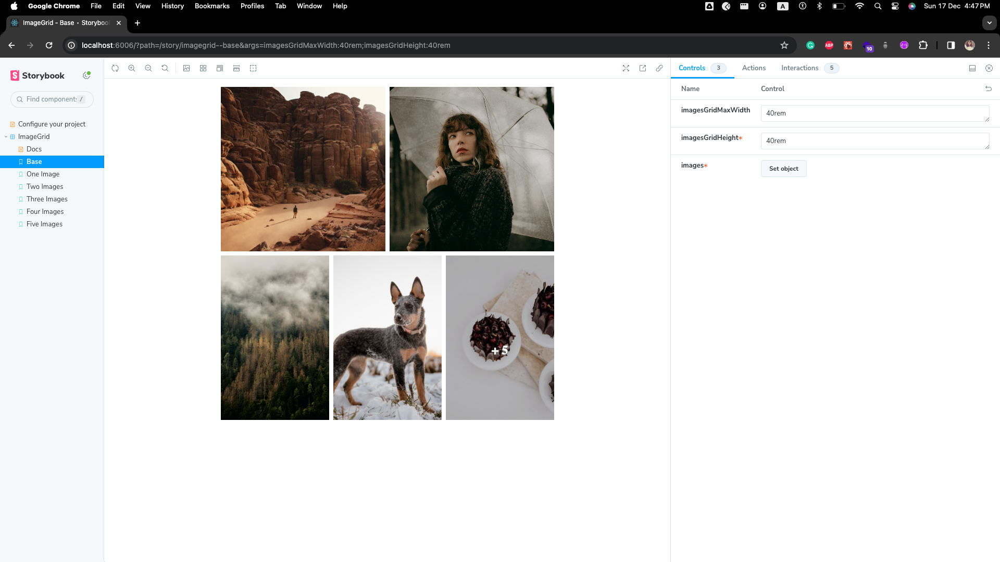
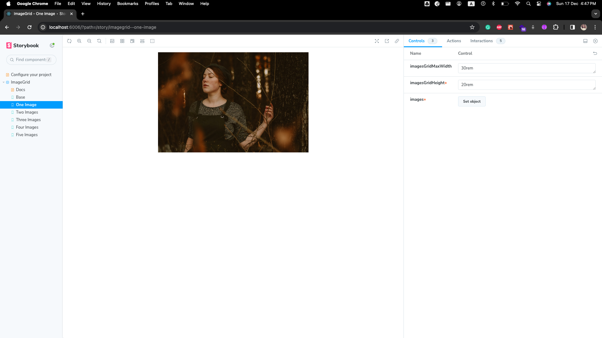
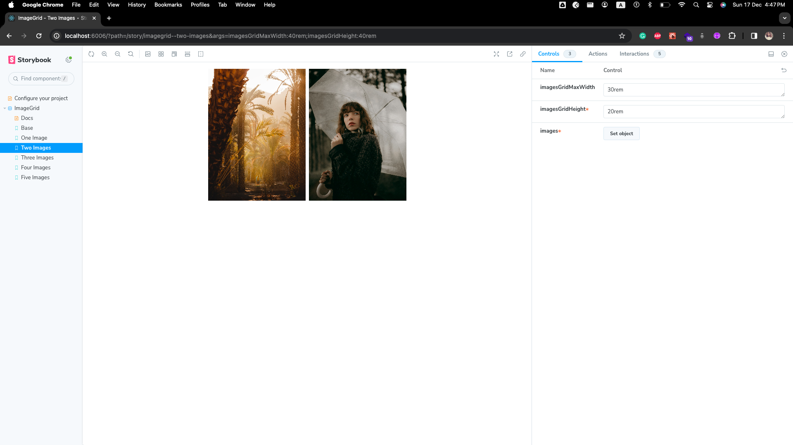
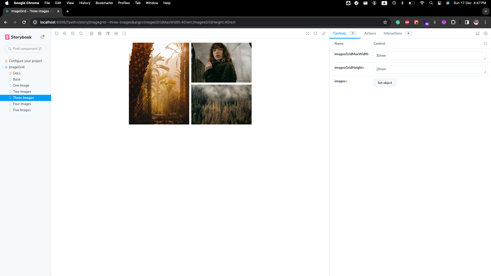
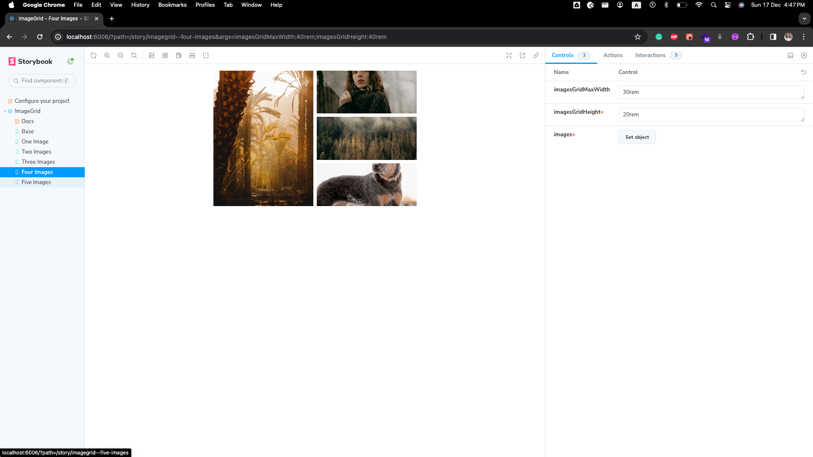
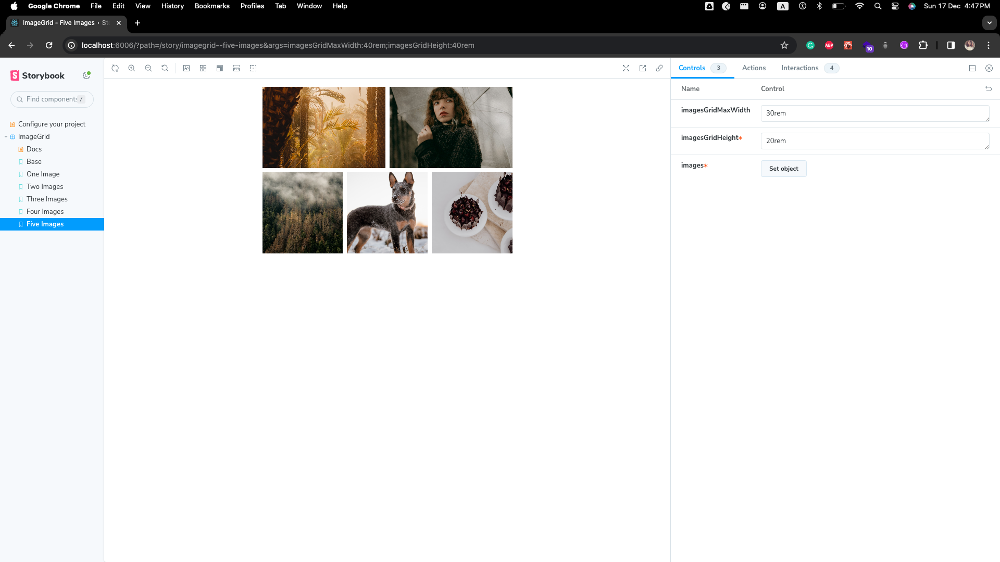

# Getting Started with Facebook Images Layout

Facebook-images-layout library which displays them in beautiful grids , iinspired from facebook

# Table of contents

1. [Installation](#installation)
2. [Demo](#demo)
3. [Basic Usage](#basic-usage)

# Installation

- Using NPM
  `npm i facebook-img-grid`

# Demo

## can layout different number of images

| Base Case                                                | One Image                                                   | Two Images                                                  |
| -------------------------------------------------------- | ----------------------------------------------------------- | ----------------------------------------------------------- |
|  |  |  |

| Three Images                                                    | Four images                                                     | Five Images                                                     |
| --------------------------------------------------------------- | --------------------------------------------------------------- | --------------------------------------------------------------- |
|  |  |  |

## Story interactions


## Demo Carousel


# Basic Usage of Image Grid

- For image grid of 1 image with modal

  ```
  import { ImageGridComponent } from "facebook-img-grid";

  function App() {
    return (
        <ImageGridComponent
          images={[
            {
              alt: 'a person standing in a canyon surrounded by rocks',
              url: 'https://images.unsplash.com/photo-1682695794816-7b9da18ed470?crop=entropy&cs=tinysrgb&fit=max&fm=jpg&ixid=M3w1MDk3MzJ8MXwxfGFsbHwxfHx8fHx8Mnx8MTcwMjc5OTQwMnw&ixlib=rb-4.0.3&q=80&w=1080'
            },
          ]}
          imagesGridHeight="20rem"
          imagesGridMaxWidth="30rem"
        />
    );
  }

  export dafault App;
  ```

- For image grid of more than 5 images with modal

  ```
  import { ImageGridComponent } from "facebook-img-grid";

  function App() {
    return (
        <ImageGridComponent
          images={[
            {
              alt: 'a person standing in a canyon surrounded by rocks',
              url: 'https://images.unsplash.com/photo-1682695794816-7b9da18ed470?crop=entropy&cs=tinysrgb&fit=max&fm=jpg&ixid=M3w1MDk3MzJ8MXwxfGFsbHwxfHx8fHx8Mnx8MTcwMjc5OTQwMnw&ixlib=rb-4.0.3&q=80&w=1080'
            },
            {
              alt: 'a woman holding an umbrella in a forest',
              url: 'https://images.unsplash.com/photo-1702700485044-652cbbd41fde?crop=entropy&cs=tinysrgb&fit=max&fm=jpg&ixid=M3w1MDk3MzJ8MHwxfGFsbHwyfHx8fHx8Mnx8MTcwMjc5OTQwMnw&ixlib=rb-4.0.3&q=80&w=1080'
            },
            {
              alt: 'a forest covered in lots of trees under a cloudy sky',
              url: 'https://images.unsplash.com/photo-1702659610398-58d3fb3f65f2?crop=entropy&cs=tinysrgb&fit=max&fm=jpg&ixid=M3w1MDk3MzJ8MHwxfGFsbHwzfHx8fHx8Mnx8MTcwMjc5OTQwMnw&ixlib=rb-4.0.3&q=80&w=1080'
            },
            {
              alt: 'a black and brown dog standing in the snow',
              url: 'https://images.unsplash.com/photo-1702611120121-e03dafc14150?crop=entropy&cs=tinysrgb&fit=max&fm=jpg&ixid=M3w1MDk3MzJ8MHwxfGFsbHw0fHx8fHx8Mnx8MTcwMjc5OTQwMnw&ixlib=rb-4.0.3&q=80&w=1080'
            },
            {
              alt: 'two white plates topped with chocolate cake on top of a table',
              url: 'https://images.unsplash.com/photo-1702323213406-db43f134bd80?crop=entropy&cs=tinysrgb&fit=max&fm=jpg&ixid=M3w1MDk3MzJ8MHwxfGFsbHw1fHx8fHx8Mnx8MTcwMjc5OTQwMnw&ixlib=rb-4.0.3&q=80&w=1080'
            },
            {
              alt: 'a couple of animals standing on top of a rocky hillside',
              url: 'https://images.unsplash.com/photo-1682687221213-56e250b36fdd?crop=entropy&cs=tinysrgb&fit=max&fm=jpg&ixid=M3w1MDk3MzJ8MXwxfGFsbHw2fHx8fHx8Mnx8MTcwMjc5OTQwMnw&ixlib=rb-4.0.3&q=80&w=1080'
            },
          ]}
          imagesGridHeight="20rem"
          imagesGridMaxWidth="30rem"
        />
    );
  }

  export dafault App;
  ```

# props

| Accepted props | type    | Description                                                                         |
| -------------- | ------- | ----------------------------------------------------------------------------------- |
| imagesGridMaxWidth      | string | set maximum Width for Image Grid Component |
| imagesGridHeight      | string | set height for Image Grid Component |
| images      | ImageFormat[{alt: string, url: string}] | List of Image Object with property: alt & url  |
